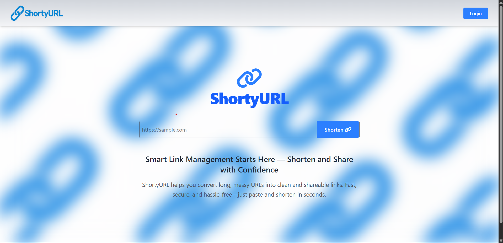
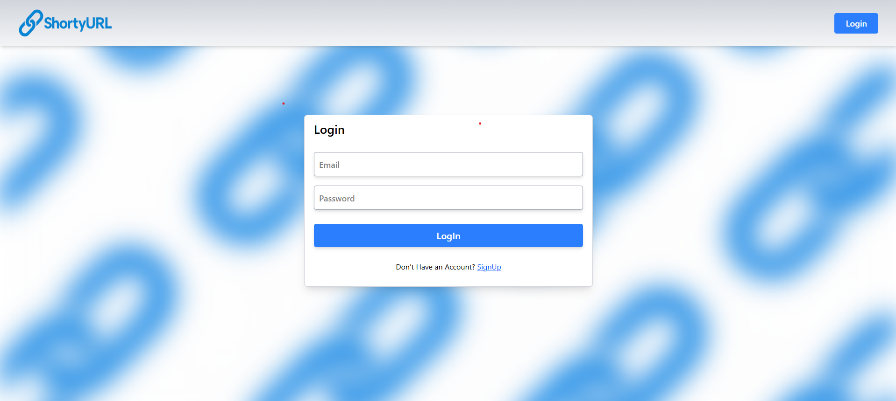
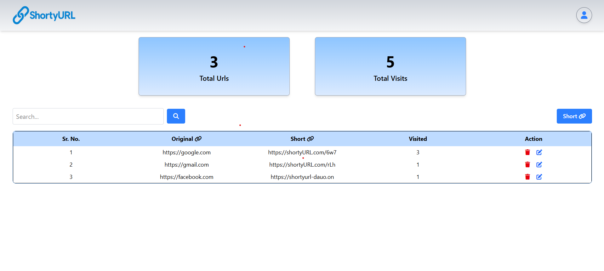

# 🔗 ShortyURL

**ShortyURL** is a sleek and simple web application that allows users to shorten long URLs, manage them, and share clean, minimal links. Built with full-stack technologies, it supports user authentication, secure access tokens with refresh tokens, and dynamic redirection — all in a smooth modern UI.

🔗 **Live Demo**: [ShortyURL](https://shortyurl-v2sz.onrender.com/)

---

## ✨ Features

- 🔐 **User Authentication** (Sign up, Login, Logout)
- ✂️ **Shorten Long URLs** into compact, shareable links
- 🔄 **Redirect** to original URLs instantly
- 🧾 **User Dashboard** to view and manage links
- 🧠 **Session Management** using **Access & Refresh Tokens**
- 🍪 Secure cookies with `httpOnly`, `secure`, `sameSite`
- 🌐 Fully responsive front-end with smooth UX

---

## 🛠️ Tech Stack

**Frontend:**

**Backend:**

---

## 🧩 Skills Used

- React functional components and hooks (`useState`, `useEffect`, `useContext`)
- Custom authentication using **JWT (access & refresh tokens)**
- Cookie-based session management (`httpOnly`, `secure`, `sameSite`)
- Route protection and middleware (`authenticateUser`)
- RESTful API integration with Axios
- Responsive UI with Tailwind CSS
- React Router DOM for routing and navigation
- Vite for fast front-end development and bundling
- Deployment with Render (Backend + Frontend)

---

## 📸 Screenshots

### 🏠 Dashboard

### 🔐 Authentication Page

### 🏠 Dashboard

### 🔗
